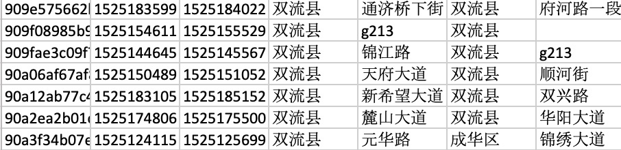
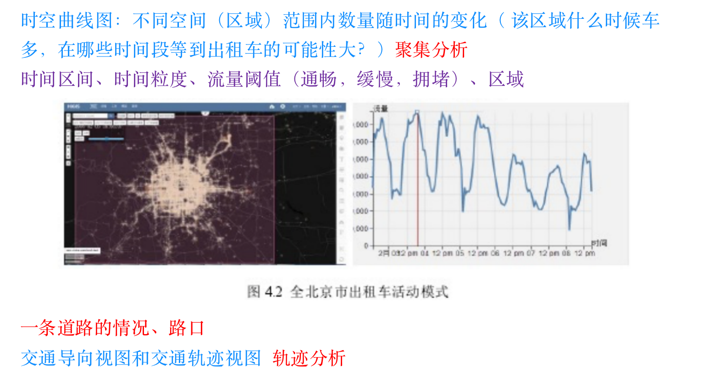
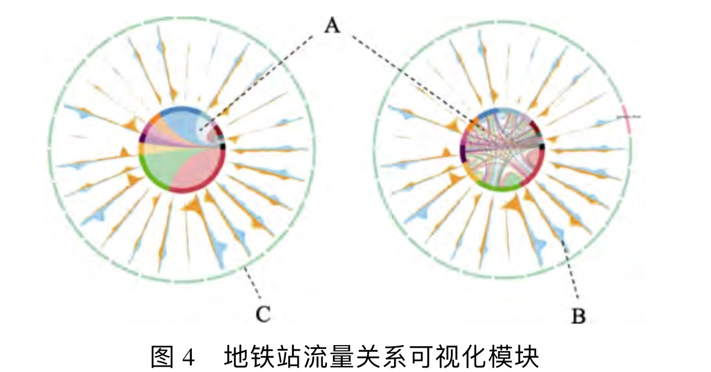
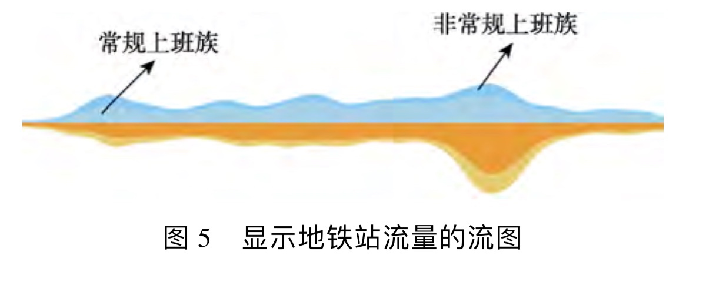
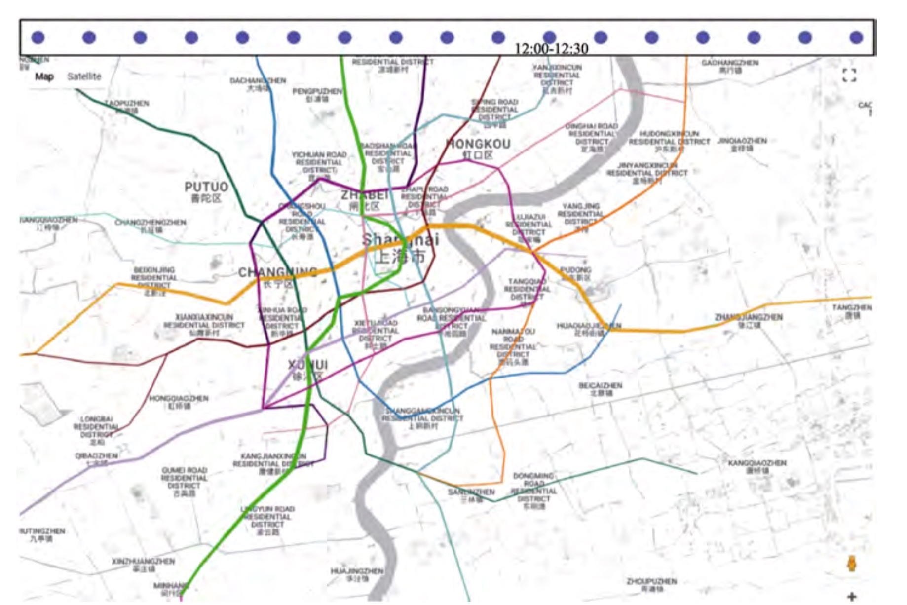

# 2019-5-27 研讨结果记录
## 实现基础
前端(mapbox+echarts+D3.....)
后端(python 的 flask 或 Django)
数据库(MongoDB 或其他)

我理解重点在于根据第一个订单数据可以快速定位第二个轨迹数据
第一个 40000 个其实终止点已经程序定位街道,但是 800 万实在有困难,所以采用以上的方法试图解决

同时也认识到,接下来的问题对于 800 万点的街道位置确实无关紧要
## 第一个问题(请您分析2018年5月1日中国现代五项赛事中心10平方公里范围内的交通流量演变情况)
____

饼图+地图
通过第一个数据,定位起始点和终点的具体街道(因为流量等属性都要以街道为单位),蓝色代表出流量,红色代表入流量,一次刻画流量变化
____

热力图+折线(面积)图
(与第一个图加个交互组件,两者在一张地图上实现装换)
此图因为800 万数据量原因,设立时间轴,演示一天的热力变化情况,同时通过折线(面积)图来具体量化这个量
____

弦图+河流图
弦图带边不同路段的流向情况,然后外层的河流图代表车辆入流量和出流量的全天演变情况
___
日历图

用来表示一天的具体哪个时段流量较为多
## 第二个问题(请您分析2018年5月1日中国现代五项赛事中心10平方公里范围内的交通拥堵情况，给出不少于3个拥堵点，并说明拥堵特征和解释拥堵原因)

堵塞特征:*平均速度,密度,流量*通过构造,实现堵塞特征的量化,将其按路段分为五个级别,分别用不同颜色代替

类似于高德地图,将不同路段根据以上特征标色
___

等时圈图
用于刻画不同位置到比赛场馆的等时圈,从而结合上一个图及热力图发现三个以上的堵塞点
## 第三个问题(请您为赛事中心管理人员和活动主办方推荐交通疏导方案)

目前的思路为等第二个问的结果
无意间发现了**百度 API 的最优路线功能**,想是够可以在第二个问找到堵塞点后进行最优路线 API 调用,为用户选择疏散方案
## 问题
1. 坐标系问题
   国內的地图(百度....)均为GCJ-02 火星坐标系
   而 mapbox 为国际坐标系WSG
1. 分段的问题,道路怎样分才合理
2. 框架的搭建,能为前端找事提供哪些的接口问题(即前端所要的数据能否通过后端快速调入)
## TODO
1. 堵塞三个属性的构建
2. 第一个数据街道的定位(已做,但是缺少对数据的处理,存在百度 API 定位不到的情况)
3. 熟悉框架

