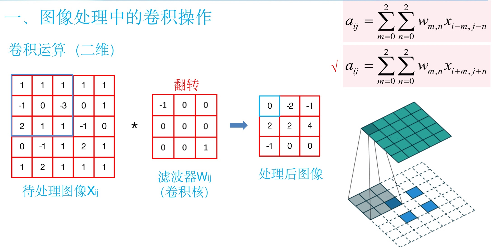
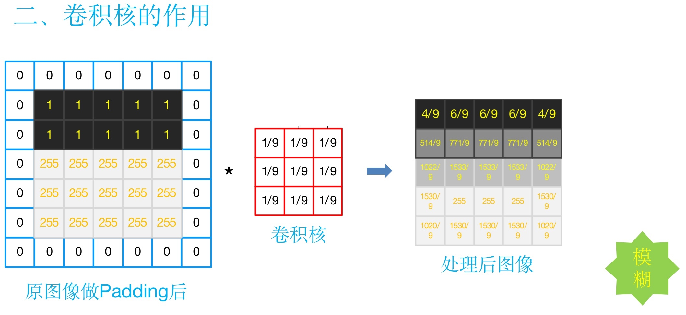

# 神经网路实验报告
>   学号：4042016011      姓名 ： 夏毅

## 实验目的 ：卷积操作在图像处理中的应用非常广泛，是深度学习中重要的特征学习手段，在图像的识别、分类中起到非常重要的作用，是深度学习的核心内容，熟练卷积操作、了解卷积核在图像处理中的作用，对于深刻理解卷积神经网络有着重要的意义
-------

## 实验原理 ：

## 实验结果
原图片：

# letnet 性能指标
 Implement the LeNet using tensorflow to recognize handwritten number. Training with MNIST. 
Some modifications here
1. Training with MNIST set with image size 28 * 28. To match the size of LeNet, the first convolution layer applied padding.
2. Using Relu instead of Sigmod as activation function.
3. Applied dropout in the FC layer.

This net can get 99.1% correct rate on MNIST test set.

## 实验结果 

我们可以看到，经过训练 36200 次左右，准确率已经非常接近于 1 了，甚至有一次出现了完全准确的情况