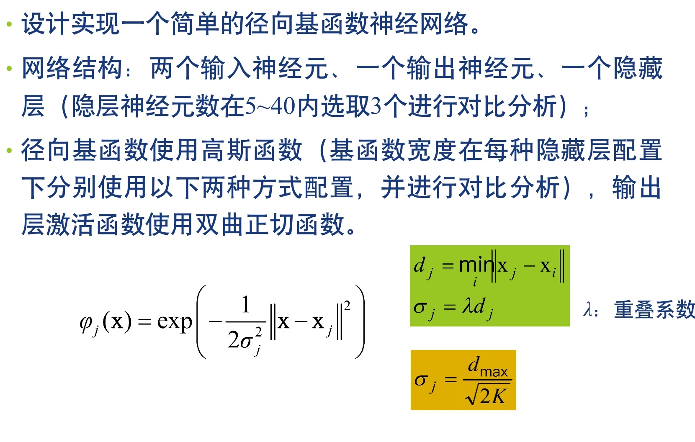

# RBF 神经网络实验报告
>  学号： 4042016011  姓名 ：夏毅

## 实验原理

## 实验要求：

## 实验过程：
###一. 首先根据实验要求构建相应的神经网络

其中包括两个输入神经元，一个输出神经元，一个隐藏层

此处为径向基函数使用的为要求的高斯函数
径向基神经网络按要求构建完成，接下来进行实验阶段
###二. 调整隐层神经元的个数，并进行对比分析

*8 个隐层*

8 个隐层经过 1500 次的训练是准确率 50%，MSE 为 0.25

*8 个隐层，两个输出神经元*

8 个隐层，两个输出神经元经过 1500 次的训练是准确率 75%，MSE 为 1.967015400933726e-07

*20 个隐层，两个输出神经元*

20 个隐层，两个输出神经元经过 1500 次的训练是准确率 100%，MSE 为 2.7910681708882323e-18  

**所以实验可得：**

| 神经元数量 | 准确率 | MSE |
| --- | --- | --- |
| 8 个隐层，1个输出 | 50% | 0.25 |
| 8 个隐层，2个输出 | 75% | 1.967015400933726e-7 |
| 20 个隐层，两个输出 | 100% | 2.7910681708882323e-18  |

##实验心得
&emsp;&emsp;此次根据教员的实验要求搭了一个 RBF 神经网络，通过实验进一步的掌握了RBF 神经网络的结构，同时通过调整参数进一步明白了在训练这个神经网络的过程中参数的重要性，及相关优化的方法。    